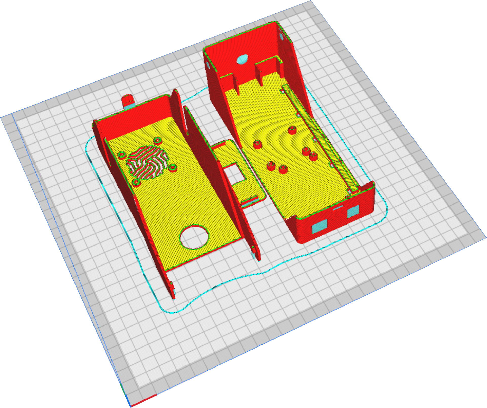
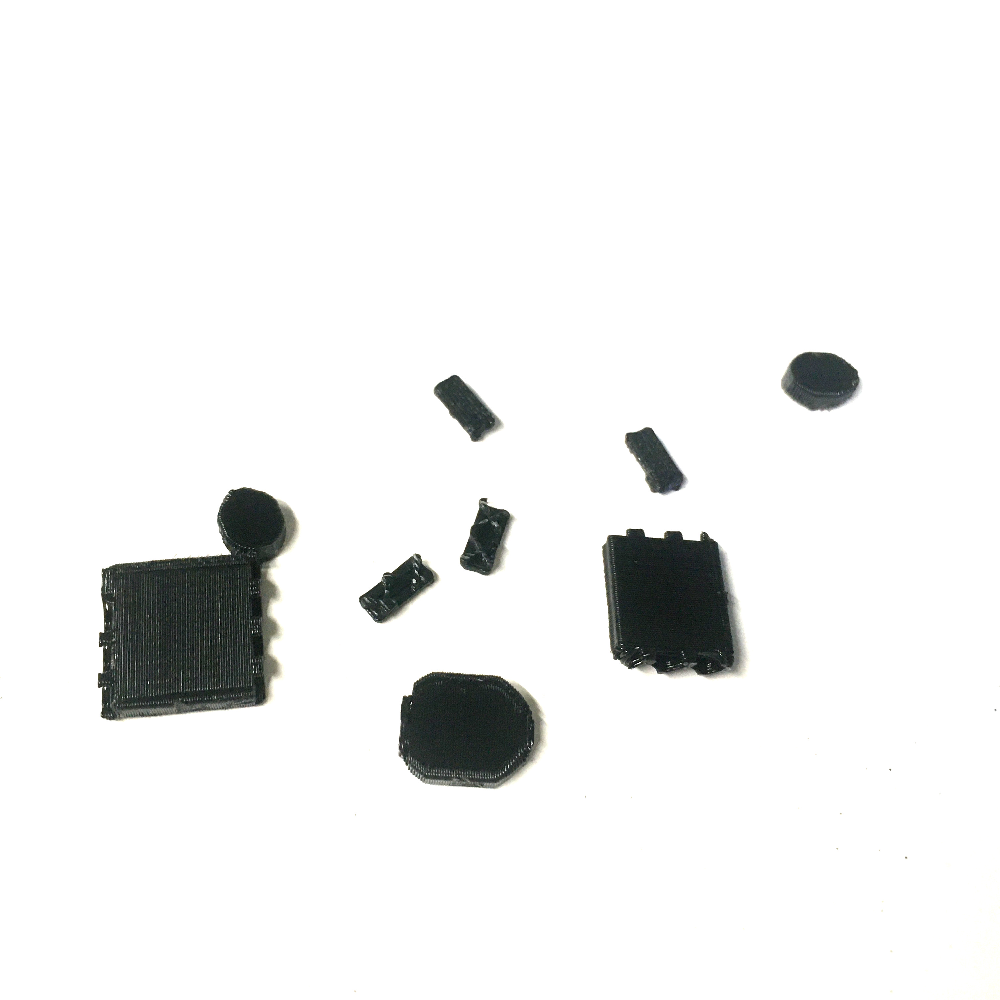
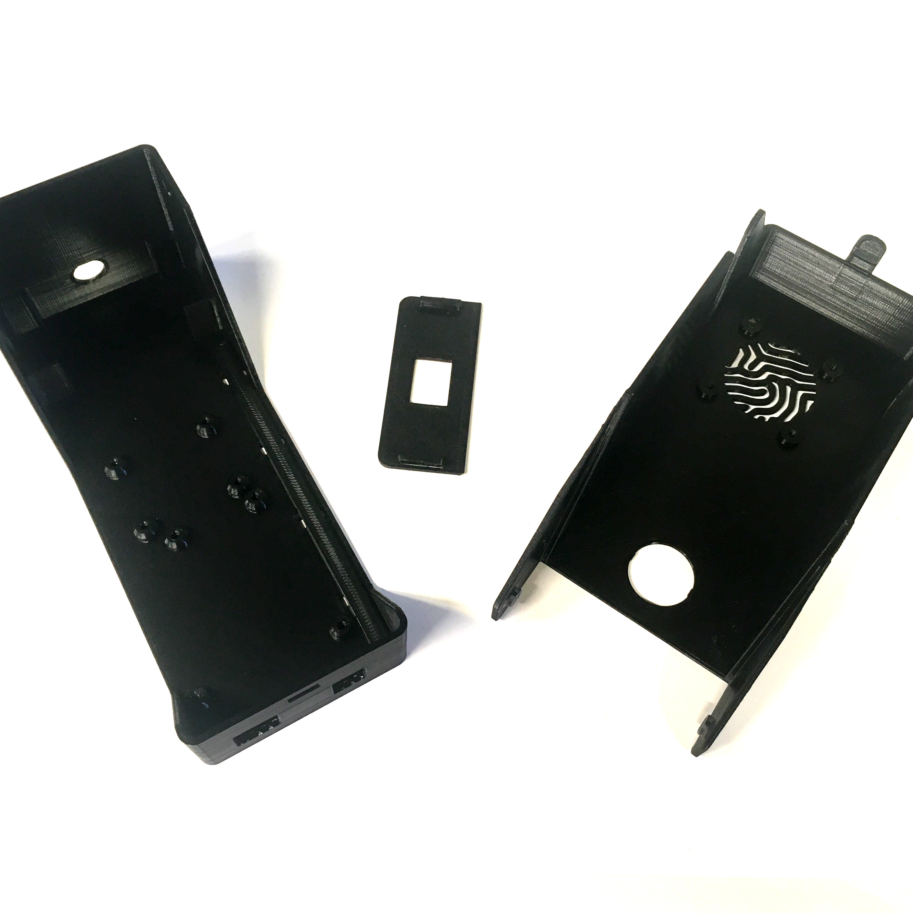

# 3D printing

{{BOM}}

The CAD parts for the flap case were created using FreeCAD and are available on the [GitHub repository linked](freecad/cad/psu_xs_V5.FCStd).

The case is composed of three parts: the base, a small lid, and the main lid. The components are made with [PLA](parts.yaml#pla){qty:150g} material using a [FDM 3D printer](tools.yaml#3dprinter){qty:1, cat:tool}.

## Slicing {pagestep}
  
Download the stl files and upload them into your slice : 

We use Cura or Kiri:moto as slicer, with the following paremeters :  

* Layer height : 0.2 mm;
* Infill : 20 %;
* Supports everywhere;
* Wall thickness : 1.2 mm.

This is what the parts look like in the slicer :  

## Post-printing {pagestep}

Once printed, carefully remove all supports.

