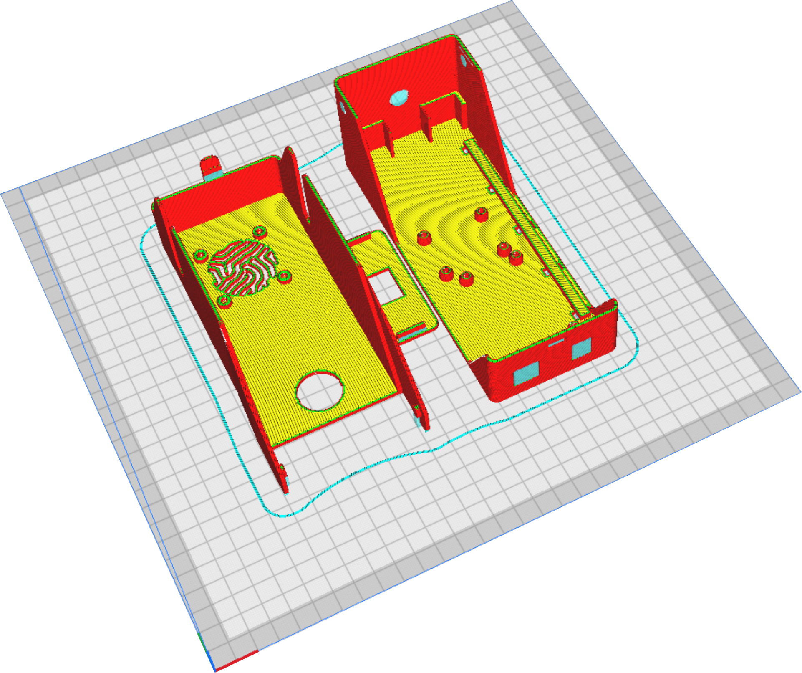
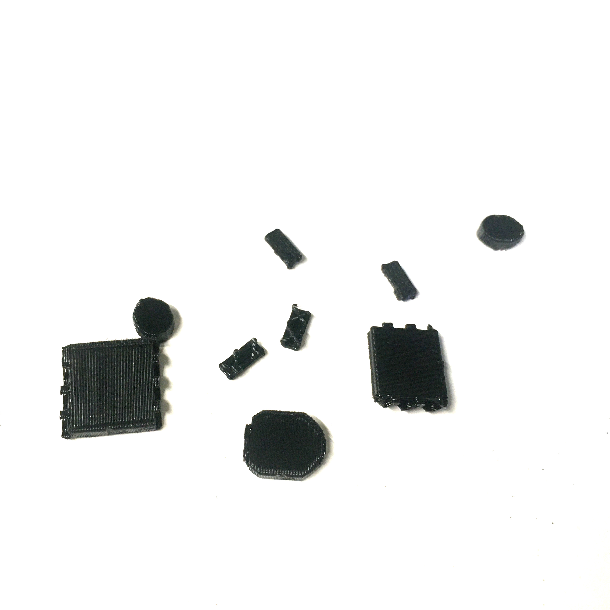
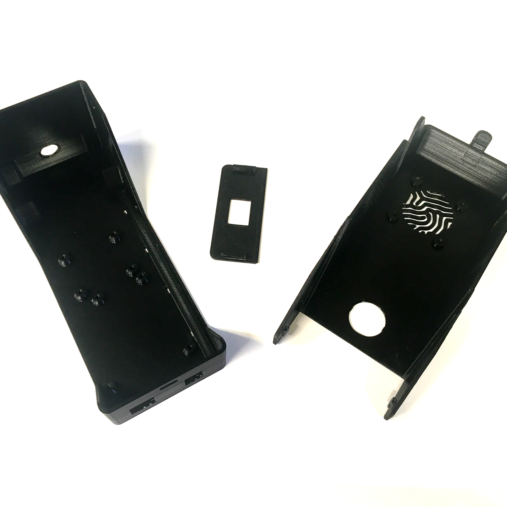

# 3D printing

### Parts

* 150 g of [PLA]{: Class="bom"} 

### Tools

* 1 [FDM 3D printer]{: Class="bom"} 

The CAD parts for the flap case were created using FreeCAD and are available on the [GitHub repository linked](freecad/cad/psu_xs_V5.FCStd "").

The case is composed of three parts: the base, a small lid, and the main lid. The components are made with [PLA] material using a [FDM 3D printer].

## Step 1: Slicing {:id="slicing" class="page-step"}
  
Download the stl files and upload them into your slice : 

We use Cura or Kiri:moto as slicer, with the following paremeters :  

* Layer height : 0.2 mm;
* Infill : 20 %;
* Supports everywhere;
* Wall thickness : 1.2 mm.

This is what the parts look like in the slicer :  

## Step 2: Post-printing {:id="post-printing" class="page-step"}

Once printed, carefully remove all supports.
[PLA]:parts/pla.md ""
[FDM 3D printer]:tools/3dprinter.md ""

---

[Previous page](index_BOM.md) | [Next page](assembling.md)