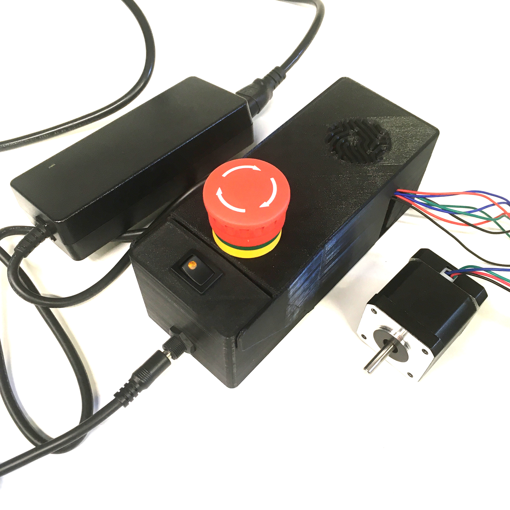

# Testing

### Parts

* 1 [12V 80W power supply]{: Class="bom"} 
* 1 [USB B cable]{: Class="bom"} 

A [12V 80W power supply] should be enough to power the CNC shield. And a [USB B cable] is needed to power the Arduino board.  

You are now ready to use the CNC shield flap case !

[12V 80W power supply]:parts/PowerSupply.md ""
[USB B cable]:parts/USBCable.md ""

---

[Previous page](assembling.md) | [Next page](more_info.md)