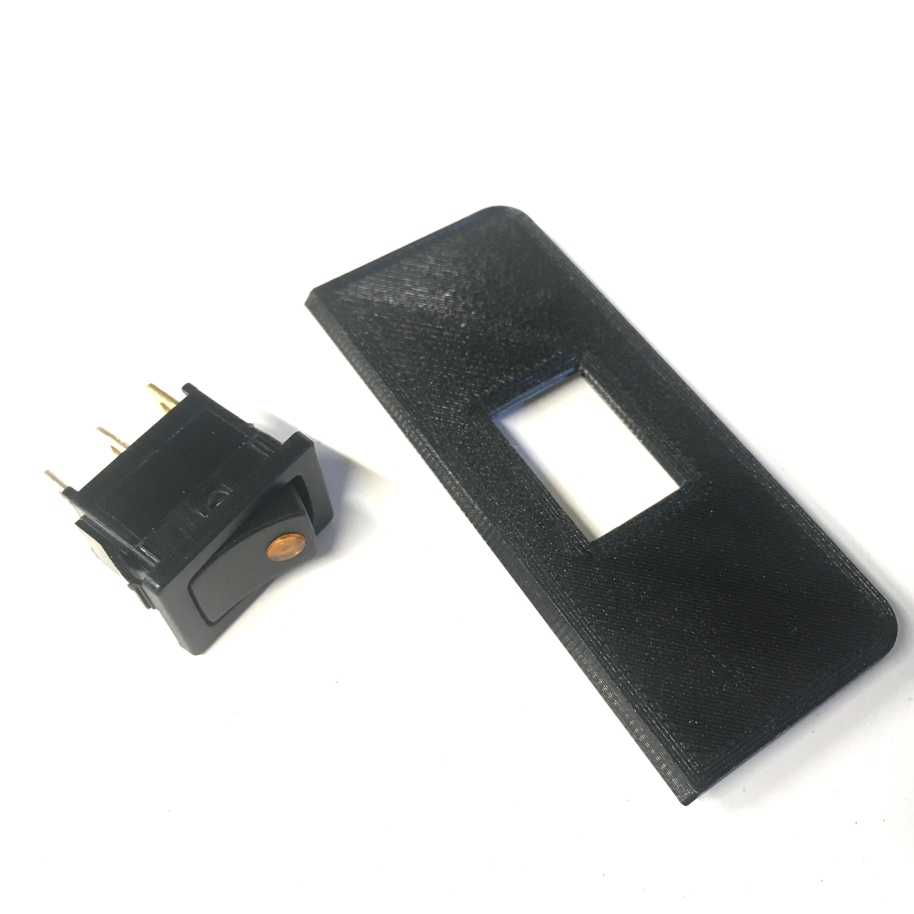

# Assembling

{{BOM}}

## Wiring {pagestep}
Before assembly, you need to prepare a few wires. You will need wire strippers and crimpers to complete this step.
  
  
  
  
 
>i **Note about stripped wires**
>i
>i The length of the stripped wire will depend on the component it is connected to. Make sure to refer to the instructions for each component if you are using different brands. The following reference lengths are provided:  
>i - 11 mm for Wagos  
>i - 8 mm for ferrules  
>i - 5 mm for blade receptacle connectors  
>i These lengths are only guidelines and may vary based on the specific components and wiring requirements, so be sure to consult the instructions for each component before stripping the wires.

### Jumper wires
If you are using the [noise filtering PCB](parts.yaml#NoiseFilteringPCB){qty:1}, you may need up to 5 [jumper wires](parts.yaml#JumperWires){qty:5} to connect the CNC shield to the PCB.  
  

### Pre-fab braid
You need 1 [pre-fab braid](parts.yaml#PrefabBraid){qty:1} (to connect to the emergency button to the CNC shield). Just cut the excess of wires to get 20 cm, then strip about 1 cm on each wire with (for example with a [wire stripper](tools.yaml#WireStripper){qty:1, cat:tool}). Attach the stripped wires to the [kill switch](parts.yaml#KillSwitch){qty:1}. 
  
### Connections to power supply
A few wires and components are needed : 

* 8 cm of a [16awg/1.5mm² red wire](parts.yaml#16awgRedWire){qty:8cm}. Strip about 5 mm on one side with the [wire stripper](tools.yaml#WireStripper), and solder this wire (with a [soldering iron](tools.yaml#SolderingIron){qty:1,cat:tool} and [soldering wire](parts.yaml#SolderingWire)) to the **central pin** of the [DC connector socket](parts.yaml#DCconnector){qty:1}. Make sure to add about 15 mm long [heat-shrink tube](parts.yaml#Heatshrink){qty:15mm} of suitable diameter. Strip the other end of the wire of about 11 mm.
* 8 cm of a [16awg/1.5mm² black wire](parts.yaml#16awgBlackWire){qty:8cm}. Strip about 5 mm on one side with the [wire stripper](tools.yaml#WireStripper), and solder this wire (with a [soldering iron](tools.yaml#SolderingIron){qty:1,cat:tool} and [soldering wire](parts.yaml#SolderingWire)) to the **external pin** of the [DC connector socket](parts.yaml#DCconnector). Make sure to add about 15 mm long [heat-shrink tube](parts.yaml#Heatshrink){qty:15mm} of suitable diameter. Strip the other end of the wire of about 11 mm.  
   
* Another 8 cm long [16awg/1.5mm² red wire]{qty:8cm}. Strip one side of this wire on about 11 mm, and strip the other end on about 5 mm and add a [blade receptacle connector](parts.yaml#BladeReceptacleConnector){qty:1}. Crimp the blade connector with a [crimping pliers](tools.yaml#CrimpingPliers){qty:1,cat:tool}.
* Another 8 cm long [16awg/1.5mm² black wire](parts.yaml#16awgBlackWire){qty:8cm}. Strip one side of this wire on about 11 mm, and strip the other end on about 5 mm and add a [blade receptacle connector](parts.yaml#BladeReceptacleConnector){qty:1}. Crimp the blade connector with a [crimping pliers](tools.yaml#CrimpingPliers){qty:1,cat:tool}.
   
* 20 cm of a [16awg/1.5mm² black wire](parts.yaml#16awgBlackWire){qty:20cm}. Strip one side of this wire on about 11 mm, then strip the other end on about 5 mm and add a [blade receptacle connector](parts.yaml#BladeReceptacleConnector){qty:1}.
* 20 cm of a [16awg/1.5mm² red wire](parts.yaml#16awgRedWire){qty:20cm}. Strip one side of this wire on about 8 mm, and add a [ferrule](parts.yaml#Ferrule){qty:1}, then strip the other end on about 5 mm and add a [blade receptacle connector](parts.yaml#BladeReceptacleConnector){qty:1}.
   

Here are all the 16awg/1.5mm² wires:  
   

### Fan wires
Make sure the [fan](parts.yaml#Fan){qty:1} wires are about 30 cm long, then strip about 11 mm on each end.
   

 
## First components to attach {pagestep}
   
   
   
   
   
 
 
 
The following components are easy to install into the case:

* Detach the 2 parts of the [kill switch](parts.yaml#KillSwitch), place the button on the lid, attach it with its plastic nut, then clip the last part to fully assemble it.  
* Attach the DC connector into the case.
* Clip both [wagos](parts.yaml#Wagos){qty:2} into the case.
* Snap-in the [toggle switch](parts.yaml#ToggleSwitch){qty:1} to the small lid. 

## Components attached with screws {pagestep}
 
 
 
A few components need screws to attach them to the box:

* The [Arduino Uno board](parts.yaml#Arduino){qty:1} needs 4 [M3x6mm screws](parts.yaml#M3x6mm){qty:4}. 
* The [noise filtering PCB](parts.yaml#NoiseFilteringPCB) needs 4 [M3x6mm screws](parts.yaml#M3x6mm){qty:4};
* The [fan](parts.yaml#Fan) needs 4 [M3x12mm screws](parts.yaml#M3x12mm){qty:4}.

Note: Use an [Allen wrench](tools.yaml#AllenWrench){qty:1,cat:tool} to attach the components securely.

## Final assembling {pagestep}
### Wiring
 
 
 
 
 
 
 
The last steps for the wiring are the following:

* Insert all red stripped wires into 1 [wago](parts.yaml#Wagos).
* Insert all black stripped wires into the other [wago](parts.yaml#Wagos).
* Attach the blade receptacle connector from the 8 cm black wire to the colored pin of the toggle switch (the one below the orange light). *If you bought another toggle switch, make sure to read the datasheet to check were the GND should be plugged*.
* Attach the blade receptacle connector from the 8 cm red wire to the opposite pin of the toggle switch.
* Attach the blade receptacle connector from the 20 cm long red wire to the centered pin of the toggle switch.
* Finally, insert the 20 cm long black and red wires with the ferrules into the "-" and "+" terminal block of the CNC shield, then tighten the screws with a [small flat screwdriver](tools.yaml#FlatScrewdriver){qty:1,cat:tool}. You can then plug the [CNC shield](parts.yaml#CNCShield){qty:1}.

There are now a few wires to plug:  

* Attach the [pre-fab braid](parts.yaml#PrefabBraid) to the kill switch, and to the "E-STOP" pins on the CNC shield.
* If you have a noise filtering PCB, plug it with the 5 jumper wires to the CNC shield.

### Assemble the case
 
 
 
 
 
Attach the small lid then the lid onto the base.

Now to organize these wires, you can use 2 [cable ties](parts.yaml#CableTies){qty:2} to attach the 20 cm long wires to the case, and 2 other [cable ties](parts.yaml#CableTies){qty:2} to attach the kill switch and fan wires together.

