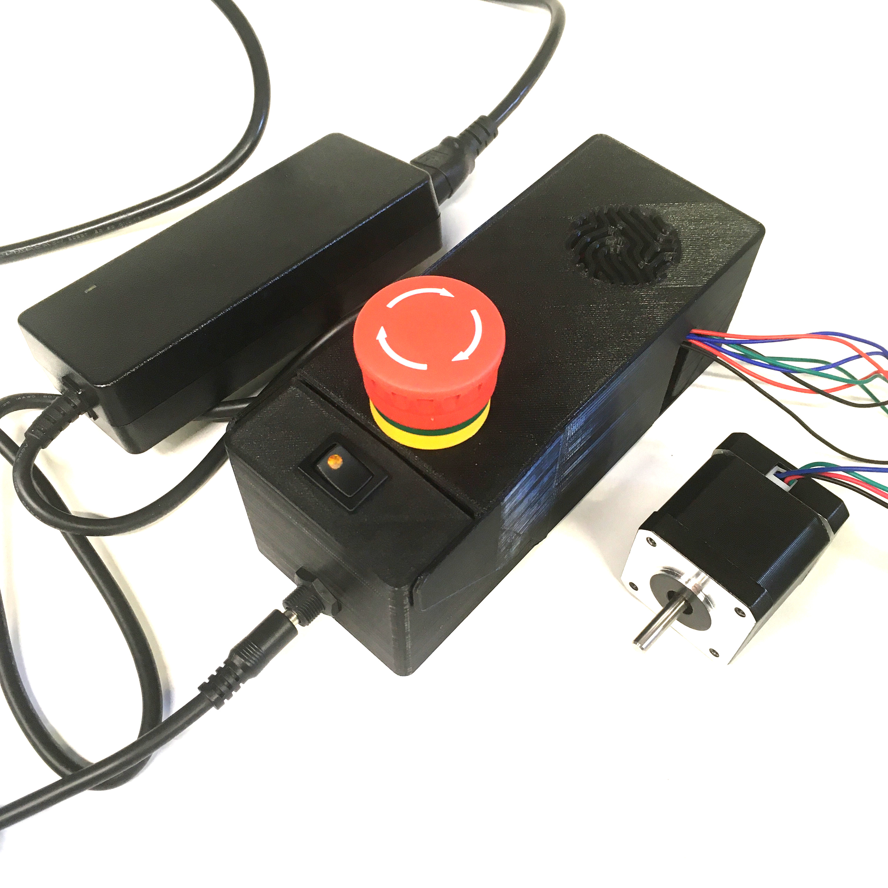

 # Testing
{{BOM}}

A [12V 80W power supply](parts.yaml#PowerSupply){qty:1} should be enough to power the CNC shield. And a [USB B cable](parts.yaml#USBCable){qty:1} is needed to power the Arduino board.  

You are now ready to use the CNC shield flap case !

